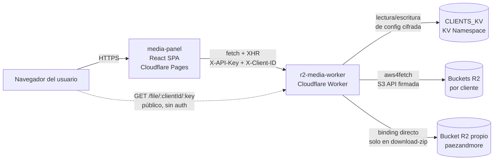

# Informe de Pruebas de Software — Panel Media (r2-media-worker + media-panel)

> **Curso:** Análisis y Modelación de Sistemas de Software
> **Proyecto:** Panel Media de Mizcor (backend `r2-media-worker` + frontend `media-panel`)
> **Rama de trabajo:** `feat/testing-suite` (en ambos repositorios)
> **Fecha:** abril 2026
> **Versión del documento:** v1 — borrador para revisión
> **Estado:** secciones 1–3 completas; secciones 4–9 pendientes (se desarrollan conforme avanza la implementación).

---

## Tabla de contenidos

1. [Descripción del proyecto y arquitectura](#1-descripción-del-proyecto-y-arquitectura)
2. [Identificación de pruebas unitarias](#2-identificación-de-pruebas-unitarias)
3. [Identificación de pruebas de integración](#3-identificación-de-pruebas-de-integración)

---

## 1. Descripción del proyecto y arquitectura

### 1.1 Contexto y Sistema Bajo Prueba (SUT)

El proyecto objeto de este ejercicio es **Panel Media**, una aplicación interna de la agencia Mizcor diseñada como gestor tipo "drive" para los activos gráficos (principalmente imágenes) de sus clientes. La aplicación está desplegada en la infraestructura de Cloudflare y se compone de dos artefactos desplegables independientes:

- **`r2-media-worker`** — Cloudflare Worker que expone una API HTTP sobre buckets de Cloudflare R2 (compatibles con la API de S3). Es el componente servidor del sistema; media toda comunicación con el almacenamiento, persistencia de configuración de clientes y control de acceso.
- **`media-panel`** — Single Page Application construida en React 19 + Vite que consume la API del worker. Provee la interfaz gráfica para operar sobre archivos y carpetas, administrar clientes y ejecutar operaciones en lote.

Conforme a la definición del SWEBOK, las pruebas de software constituyen la *validación dinámica* de que el SUT proporciona los comportamientos esperados en un conjunto finito de casos de prueba. En este ejercicio, el SUT comprende **ambos repositorios operando en conjunto**. No obstante, por razones de testabilidad y aislamiento (principios de controlabilidad y replicabilidad señalados por el SWEBOK), las suites de prueba se organizan por repositorio y se complementan con pruebas de integración entre ambos.

El proyecto ha estado en producción atendiendo al cliente **Paez And More** (instalador de pisos en Carolina del Sur) desde el cuarto trimestre de 2025. El ejercicio se enmarca en un momento oportuno: el sistema ya está estable, tiene volumen de uso real, pero **no fue escrito con pruebas automatizadas**. La ausencia total de pruebas previas fue el criterio de elegibilidad establecido por la actividad académica.

### 1.2 Arquitectura

**Notas sobre el diagrama:**

- El endpoint `GET /file/:clientId/:key` se muestra con línea punteada porque es el único camino **no autenticado** de la API; cualquier navegador con la URL puede acceder. Esta decisión arquitectónica es intencional (URLs públicas para imágenes embebidas en sitios de cliente), pero su verificación explícita forma parte del plan de pruebas de seguridad (ver sección 4).
- El binding `BUCKET` de R2 y las credenciales S3 por cliente apuntan a buckets distintos en el flujo general. La única excepción es el endpoint `POST /api/download-zip`, que usa el binding directo. Esta heterogeneidad es una fuente conocida de riesgo y está registrada como hallazgo (ver sección 2.5).

### 1.3 Componentes y responsabilidades

| Componente | Responsabilidad principal | Tecnologías clave |
|------------|---------------------------|-------------------|
| `media-panel` | Interfaz gráfica, procesamiento de imágenes en el browser (WASM), generación de ZIP y assets.ts, navegación de archivos, administración de clientes. | React 19, Vite 7, Tailwind 4, `@jsquash/*` (WASM), `fflate`. |
| `r2-media-worker` | API HTTP autenticada, cifrado/descifrado de credenciales S3, enrutamiento manual, operaciones sobre R2 vía S3 API. | Cloudflare Workers runtime, `aws4fetch`, `fflate`, Web Crypto API (AES-256-GCM). |
| `CLIENTS_KV` | Persistencia del catálogo de clientes y sus credenciales cifradas. | Cloudflare KV. |
| Buckets R2 por cliente | Almacenamiento de los archivos (imágenes, carpetas representadas como marcadores). | Cloudflare R2 (compatible S3). |

### 1.4 Dependencias externas

Las pruebas deben contemplar que el SUT depende de servicios externos que **no pueden reproducirse fielmente en un entorno de laboratorio**:

- **Cloudflare Workers runtime** — reproducible mediante Miniflare, que el pool `@cloudflare/vitest-pool-workers` invoca bajo el capó. Esta reproducibilidad es lo que hace viable el plan de integración para el worker sin recurrir a stubs manuales.
- **Cloudflare R2 (API S3)** — Miniflare simula R2 en memoria. Las pruebas no tocan la API real de Cloudflare.
- **Cloudflare KV** — Miniflare simula KV también en memoria.
- **`@jsquash/*` WASM codecs** — ejecutan en el browser; en JSDOM no están disponibles. Se establece como decisión excluir del alcance unitario el procesamiento WASM de imagen (ver sección 1.6).

### 1.5 Supuestos y alcance

Este ejercicio adopta los siguientes supuestos, que se explicitan para preservar el principio de *generalización* (SWEBOK sección 1.2) — el lector del documento debe poder juzgar en qué medida estas pruebas aplican a contextos análogos.

- **Supuesto 1.** El comportamiento de Miniflare sobre los bindings de R2 y KV es fiel al comportamiento de Cloudflare en producción. No se ejecutarán pruebas contra la infraestructura real de Cloudflare.
- **Supuesto 2.** La `MASTER_KEY` usada para cifrar credenciales en KV se mantiene constante durante toda la ejecución de una suite de pruebas. La rotación de claves queda explícitamente fuera de alcance.
- **Supuesto 3.** Los archivos de imagen utilizados como fixtures son sintéticos (bytes controlados) y no necesariamente decodificables por un parser real de imagen. Esto es aceptable porque el worker no valida contenido de imagen, solo MIME declarado y tamaño.
- **Supuesto 4.** La especificación a validar es la que se deriva del código actual; no existe un documento de requisitos separado. Conforme a la advertencia del SWEBOK sobre el "problema del oráculo", esto implica que las pruebas confirmarán *comportamiento actual* y detectarán **regresiones** futuras, pero no necesariamente desviaciones frente a una intención original que no está documentada. Los casos donde el comportamiento actual es cuestionable se registran como hallazgos.

**Objetivos del ejercicio**, en orden de prioridad:

1. Demostrar aplicación sistemática de las técnicas de prueba del SWEBOK capítulo 3 (partición de equivalencia, valores límite, tabla de decisión, transición de estados, mutación).
2. Cubrir con pruebas automáticas la lógica de negocio crítica y las superficies donde un fallo tendría impacto en clientes reales (autenticación, cifrado de credenciales, reglas de prod vs test).
3. Producir un entregable académico trazable que además quede como documentación viva del proyecto en Mizcor.
4. Identificar hallazgos concretos (bugs, inconsistencias, deuda técnica) como subproducto del ejercicio, susceptibles de convertirse en Decision Records (DR) posteriores.

### 1.6 Fuera de alcance

Las siguientes áreas se excluyen deliberadamente. La exclusión es parte del plan de pruebas (no una omisión), y cada exclusión se justifica:

- **Pruebas sobre procesamiento WASM de imagen (`@jsquash/*`).** Requieren un entorno de browser real; JSDOM no implementa `OffscreenCanvas` ni `createImageBitmap`. Ejecutarlas demandaría Playwright, cuyo costo de infraestructura excede el alcance del ejercicio. Se delega a una fase posterior.
- **Pruebas end-to-end contra Cloudflare real.** Requerirían credenciales de producción, afectarían buckets reales de cliente y romperían la replicabilidad. El uso de Miniflare provee cobertura equivalente para la mayoría de casos.
- **Pruebas de carga, estrés y rendimiento (SWEBOK sección 2, *Performance / Load / Stress Testing*).** El volumen actual del sistema (un cliente activo, buckets < 1 GB) no justifica esta inversión. Se registran como línea de trabajo futura.
- **Ejecución de pruebas de usabilidad.** Por instrucción explícita de la actividad, la sección 6 del documento (cuando se redacte) contendrá el *plan* de pruebas de usabilidad pero no los resultados de ejecución.
- **Pruebas de accesibilidad automatizadas (axe, Lighthouse).** Los hallazgos sobre ausencia de atributos ARIA y etiquetas semánticamente vinculadas se documentarán en la sección 6 como parte del plan de usabilidad, pero no se automatizará la verificación en esta iteración.

---

## 2. Identificación de pruebas unitarias

### 2.1 Criterio de selección

Siguiendo la definición del SWEBOK (nivel de prueba *unit testing*: "verifican el funcionamiento aislado de los elementos del SUT que pueden probarse por separado"), se identifican como candidatos los elementos que cumplen al menos uno de los siguientes criterios:

- **C1 — Función pura o determinística.** Transforma entradas en salidas sin efectos secundarios observables sobre KV, R2 o el DOM. Ejemplos: cifrado simétrico, sanitización de cadenas, cálculo de límites.
- **C2 — Módulo con interfaz clara.** Una función o clase exportada con contrato tipado, cuyas dependencias externas pueden sustituirse por dobles de prueba sin reescritura.
- **C3 — Reglas de negocio extraíbles.** Lógica de validación actualmente inline en handlers HTTP o en componentes React, que se refactoriza como función pura para ganar testabilidad (concepto explícito del SWEBOK: "la facilidad con la que se puede satisfacer un criterio de cobertura de prueba dado").

La priorización se realiza por producto de *riesgo × visibilidad*: una función que maneja credenciales cifradas es de riesgo alto aunque sea invisible al usuario; una función que genera slugs SEO es de riesgo bajo pero alta visibilidad.

**Decisión 2.1.** Cuando una regla de negocio esté inline en un handler (por ejemplo, la validación de tamaño máximo dentro de `POST /api/upload`), se preferirá **extraerla como función pura** antes de probarla, en lugar de cubrirla solo por integración. Esto mejora la testability del código como efecto secundario deseable y alinea el ejercicio con las buenas prácticas de shift-left testing del SWEBOK. Los refactors se registran en commits separados.

### 2.2 Pruebas unitarias — Worker

| ID | Módulo / función | Ubicación | Técnica SWEBOK | Casos representativos | Prioridad |
|----|------------------|-----------|----------------|------------------------|-----------|
| **U-W-01** | `encrypt(plaintext, masterKey)` | `src/crypto.ts` | Partición de equivalencia + caja blanca | (a) roundtrip `decrypt(encrypt(x)) === x`; (b) entrada vacía; (c) entrada con caracteres Unicode/emoji; (d) entrada binaria. | Alta |
| **U-W-02** | `encrypt` — unicidad de IV | `src/crypto.ts` | Pruebas de seguridad (propiedad) | Dos llamadas consecutivas con el mismo plaintext y la misma masterKey producen `iv` distintos y por tanto `data` distintos. Ejecución repetida N veces (prueba de propiedad). | **Crítica** |
| **U-W-03** | `decrypt` — fallos controlados | `src/crypto.ts` | Excepciones forzadas | (a) masterKey incorrecta → error; (b) blob con `iv` truncado → error; (c) blob con `data` manipulado (tampering) → error por tag de autenticación GCM. | Alta |
| **U-W-04** | `resolveOrigin(request, env)` | `src/cors.ts` | Partición de equivalencia + tabla de decisión | Cinco clases: (a) origen en allowlist hardcoded; (b) origen == `env.ALLOWED_ORIGIN`; (c) origen no reconocido; (d) header `Origin` ausente; (e) header `Origin` vacío. | Alta |
| **U-W-05** | `corsHeaders(origin)` | `src/cors.ts` | Partición de equivalencia | Verifica presencia de las 4 claves esperadas y que `Access-Control-Allow-Origin` refleja fielmente el parámetro. | Media |
| **U-W-06** | `isAuthorized(request, env)` | `src/router.ts` | Partición de equivalencia | (a) header correcto → true; (b) header incorrecto → false; (c) header ausente → false; (d) header vacío → false; (e) `env.API_SECRET` vacío y header vacío → false (no debe autenticar). | **Crítica** |
| **U-W-07** | `sanitizeEndpoint(endpoint, bucketName)` ⚠️ | *Extraer de* `src/router.ts:90-94` | Valores límite | (a) sin trailing slash ni sufijo → sin cambios; (b) con trailing slash → lo quita; (c) con sufijo `/bucketName` → lo quita; (d) con ambos → quita ambos; (e) con múltiples trailing slashes → los quita todos; (f) cadena vacía → vacía. | Alta |
| **U-W-08** | Validación de MIME permitido ⚠️ | *Extraer de* `src/router.ts:231-233` | Partición de equivalencia | Clases válidas (6 MIMEs permitidos) y clases inválidas: (a) MIME vacío; (b) `image/` sin subtipo; (c) `application/pdf`; (d) `image/tiff` (imagen no permitida); (e) `image/svg+xml` (sí permitida). | Alta |
| **U-W-09** | Validación de tamaño máximo ⚠️ | *Extraer de* `src/router.ts:236-238` | Valores límite | (a) 0 bytes → rechazo o aceptación según decisión; (b) 1 byte → ok; (c) 10 MB − 1 → ok; (d) exactamente 10 MB → ok; (e) 10 MB + 1 → rechazo; (f) 100 MB → rechazo. | **Crítica** |
| **U-W-10** | Validación de `cache-control` allowlist ⚠️ | *Extraer de* `src/router.ts:246-254` | Partición de equivalencia | (a) los 3 valores válidos → aceptados; (b) valor inválido → ignorado silenciosamente; (c) cadena vacía → ignorado; (d) `null` → ignorado. | Media |
| **U-W-11** | Validación de `maxAge` allowlist | *Extraer de* `src/router.ts:463-466` | Partición de equivalencia + valores límite | (a) los 3 valores numéricos válidos; (b) número no permitido → default `31536000`; (c) string con número válido → ¿debería aceptarse? (el tipo actual es `number`); (d) `undefined` → default. | Media |
| **U-W-12** | Parser de path `GET /file/:clientId/:key` | `src/router.ts:22-55` | Partición de equivalencia + fuzzing | (a) path bien formado; (b) sin segundo segmento → 404; (c) `clientId` con caracteres codificados; (d) `key` con múltiples slashes; (e) `key` con caracteres especiales codificados. | Alta |

**Leyenda:** ⚠️ = requiere refactor previo (extracción de función inline a módulo testeable). Ver Decisión 2.1.

**Alcance aproximado:** 12 módulos/funciones objetivo, ~35-45 casos totales.

### 2.3 Pruebas unitarias — Frontend

| ID | Módulo / función | Ubicación | Técnica SWEBOK | Casos representativos | Prioridad |
|----|------------------|-----------|----------------|------------------------|-----------|
| **U-F-01** | `generateAssetsTs(folders, clientId)` | `src/utils/generateAssets.ts` | Partición de equivalencia + valores límite | (a) array vacío → string mínimo válido; (b) una carpeta, un archivo → estructura correcta; (c) múltiples carpetas → orden determinístico; (d) nombres con caracteres que requieren escape en literal JS; (e) `clientId` con caracteres que requieren encoding de URL. | Media |
| **U-F-02** | `toSlug(text)` en `BulkRenameModal` | `src/components/BulkRenameModal.tsx:13-20` | Partición de equivalencia + fuzzing | (a) ASCII simple; (b) con diacríticos (Ñ, á, ö); (c) con emoji; (d) múltiples espacios; (e) inicia/termina con guiones; (f) cadena vacía; (g) solo caracteres no-alfanuméricos. | Media |
| **U-F-03** | `toSlug(text)` en `UploadOptimizationModal` | `src/components/UploadOptimizationModal.tsx:31-33` | Partición de equivalencia | Mismos casos que U-F-02. **Se espera divergencia con U-F-02** — ver Hallazgo H-2.1. | Media |
| **U-F-04** | Clamp de columnas | `src/hooks/useViewPreferences.ts:25` | Valores límite | (a) 1 → 2 (MIN); (b) 2 → 2; (c) 5 → 5; (d) 8 → 8 (MAX); (e) 9 → 8; (f) -3 → 2; (g) `NaN` → comportamiento a verificar. | Media |
| **U-F-05** | `handlePresetClick` auto-ajuste de calidad | `src/hooks/useCompressionSettings.ts:87-105` | Tabla de decisión | Matriz (calidad actual) × (minQuality del preset): (a) actual < min → sube a min; (b) actual == min → sin cambio; (c) actual > min → sin cambio. | Baja |
| **U-F-06** | Sanitización de endpoint en cliente | `src/components/AddClientModal.tsx:60-66` | Valores límite | Mismos casos que U-W-07. **Lógica duplicada** con el worker; ver Hallazgo H-2.2. | Alta |
| **U-F-07** | `canSubmit` de `AddClientModal` | `src/components/AddClientModal.tsx:58` | Partición de equivalencia | Seis campos requeridos; se verifica cada uno como faltante y que la combinación "todos presentes" habilita el submit. | Media |
| **U-F-08** | Filtrado de tipos en drag-drop | `src/components/MediaPanel.tsx:390` | Partición de equivalencia | (a) solo imágenes → todas pasan; (b) mezcla imagen/no-imagen → solo imágenes; (c) solo no-imágenes → array vacío. | Media |
| **U-F-09** | `downloadTextFile(content, filename)` | `src/utils/downloadZip.ts` | Partición de equivalencia | Verifica creación de Blob, setAttribute del anchor, invocación de click, revoke del objectURL. Mocking de `URL.createObjectURL` y `document.createElement`. | Baja |
| **U-F-10** | `cacheBust(url, timestamp)` (si existe como util) | `src/components/ImageLightbox.tsx` (inline) ⚠️ | Partición de equivalencia | (a) URL sin query → agrega `?v=`; (b) URL con query → agrega `&v=`. Requiere extracción previa. | Baja |
| **U-F-11** | `ConfirmDeleteByNameModal` — validación de nombre | `src/components/ConfirmDeleteByNameModal.tsx` | Partición de equivalencia | (a) nombre exacto → confirm habilitado; (b) con espacios extra → deshabilitado; (c) case-insensitive → comportamiento a verificar. | Alta |
| **U-F-12** | `NewFolderModal` — validación de entrada | `src/components/NewFolderModal.tsx` | Partición de equivalencia + fuzzing | (a) vacío → submit deshabilitado; (b) solo espacios → deshabilitado (depende del trim); (c) caracteres inválidos para prefijos R2 → actualmente aceptados. Ver Hallazgo H-2.3. | Media |

**Leyenda:** ⚠️ = requiere refactor previo.

**Alcance aproximado:** 12 módulos/componentes, ~40-50 casos totales.

### 2.4 Técnicas SWEBOK aplicadas (resumen de esta sección)

| Técnica SWEBOK (cap. 3) | IDs donde se aplica explícitamente |
|-------------------------|-----------------------------------|
| Partición de equivalencia | U-W-01, U-W-04, U-W-05, U-W-06, U-W-08, U-W-10, U-W-11, U-W-12, U-F-01, U-F-02, U-F-03, U-F-07, U-F-08, U-F-09, U-F-11, U-F-12 |
| Análisis de valores límite | U-W-07, U-W-09, U-W-11, U-F-01, U-F-04, U-F-06 |
| Tabla de decisión | U-W-04 (origen × env), U-F-05 (calidad × preset) |
| Excepciones forzadas | U-W-03 |
| Fuzzing / pruebas aleatorias | U-W-12, U-F-02, U-F-03, U-F-12 |
| Pruebas de propiedad (no enumeradas en SWEBOK pero consistentes con *pruebas metamórficas*) | U-W-02 (propiedad de unicidad de IV) |

### 2.5 Hallazgos preliminares detectados en la fase de análisis

La fase de análisis previa a la escritura de tests ya reveló observaciones que ameritan seguimiento, independientemente de si los tests los confirman. Siguiendo la clasificación del SWEBOK sección 4 (tipos de fallas), estos se registran con ID para futura conversión a Decision Records de Mizcor.

- **H-2.1** — **Implementaciones duplicadas de `toSlug`.** La función aparece en `BulkRenameModal.tsx:13-20` y `UploadOptimizationModal.tsx:31-33`. Las inspecciones iniciales sugieren que son idénticas, pero la naturaleza copy-pasted del código las hace candidatas a divergir con el tiempo. Los tests U-F-02 y U-F-03 se escribirán con **los mismos casos** precisamente para detectar divergencia. Plan: consolidar en `src/utils/slug.ts` con un único export.
- **H-2.2** — **Sanitización de endpoint duplicada frontend/backend.** `AddClientModal.tsx:60-66` y `router.ts:90-94` implementan la misma lógica. La del frontend es ejecutada antes; la del backend es la de confianza. Ambas deberían concordar estrictamente. Los tests U-W-07 y U-F-06 se escriben con los mismos casos.
- **H-2.3** — **`NewFolderModal` no valida caracteres.** Cualquier cadena no vacía es aceptada, incluyendo caracteres que R2 puede aceptar pero que rompen la UI (por ejemplo, `/` dentro del nombre genera prefijos anidados no deseados). Registrado como prueba de UX futura; el test U-F-12 documentará el comportamiento actual.
- **H-2.4** — **Validaciones inline en handlers.** Varias reglas de negocio (tamaño máximo, MIME, allowlists) están embebidas en funciones grandes de `router.ts`. La extracción propuesta en la Decisión 2.1 mejora testability pero también prepara el código para reuso. Plan: registrar la extracción como *refactor preparatorio* en commits separados de los tests.

---

## 3. Identificación de pruebas de integración

### 3.1 Criterio de selección y estrategia

El SWEBOK define las pruebas de integración como aquellas que "verifican las interacciones entre los elementos del SUT (componentes, módulos o subsistemas)". En este proyecto se identifican **cuatro superficies de integración** distintas, cada una con su propia estrategia:

1. **Worker ↔ bindings Cloudflare (KV + R2).** Cubierta por `@cloudflare/vitest-pool-workers` con Miniflare. Los tests invocan al worker mediante el binding `SELF` y realizan aserciones sobre el estado real de KV y R2 en memoria.
2. **Worker ↔ worker (handlers encadenados).** Flujos de múltiples endpoints consecutivos (por ejemplo, crear cliente → subir archivo → listar). Misma infraestructura que la anterior.
3. **Frontend ↔ Worker (HTTP).** Cubierta por MSW (Mock Service Worker) en el repositorio del frontend. El worker se sustituye por handlers que reproducen sus contratos.
4. **Frontend ↔ DOM (componentes + hooks).** Cubierta por `@testing-library/react` en JSDOM, incluyendo interacciones de usuario simuladas con `@testing-library/user-event`.

**Estrategia de integración adoptada.** Conforme al SWEBOK sección 2 (*"Integration Testing"*), se adopta una estrategia **incremental mixta**: bottom-up para el worker (primero probamos helpers unitarios, luego handlers individuales, luego flujos encadenados) y top-down para el frontend (primero probamos los hooks que orquestan, luego los componentes que los consumen). No se adopta big-bang por ser explícitamente desaconsejado.

**Decisión 3.1.** Para el worker se crea un **helper de fixtures** (`test/helpers/factories.ts`) que encapsula la creación de un cliente de prueba (con credenciales S3 ficticias pero válidas en estructura). Esto reduce la duplicación en las suites y preserva el principio de *controlabilidad* del SWEBOK.

**Decisión 3.2.** Para el frontend, los handlers MSW se organizan por endpoint del worker, no por flujo de test. Esto previene que los tests se acoplen a handlers con semántica frágil y permite reutilizarlos en múltiples suites.

### 3.2 Pruebas de integración — Worker

| ID | Flujo / interacción | Endpoints involucrados | Técnica SWEBOK | Casos representativos | Prioridad |
|----|---------------------|------------------------|----------------|------------------------|-----------|
| **I-W-01** | CRUD completo de cliente | `POST /api/clients` → `GET /api/clients` → `PATCH /api/clients/:id` → `DELETE /api/clients/:id` | Transición de estados | Ciclo de vida completo: crear → listar (aparece) → actualizar env de 'test' a 'prod' → eliminar → listar (no aparece) → verificar KV (`creds:{id}` también desaparece). | **Crítica** |
| **I-W-02** | Upload → list → download → delete | `POST /api/upload` → `GET /api/list` → `GET /file/:clientId/:key` → `DELETE /api/delete` | Transición de estados | Flujo feliz end-to-end con un PNG pequeño sintético. Verificar que el listado refleja el upload, que el archivo es descargable sin auth y que tras delete desaparece. | **Crítica** |
| **I-W-03** | Confirmación destructiva prod vs test | `POST /api/clients` (con `env`) → `POST /api/upload` → `DELETE /api/delete` | Tabla de decisión | Matriz: `env` (test/prod/undefined) × `X-Confirmed-Name` (ausente/incorrecto/correcto). 9 combinaciones, esperando: test-cualquiera → 200; prod-ausente → 412; prod-incorrecto → 412; prod-correcto → 200; undefined tratado como prod. | **Crítica** |
| **I-W-04** | Rename de archivo (copy + delete implícito) | `POST /api/upload` → `POST /api/rename` → `GET /api/list` → `GET /file/.../destKey` | Transición de estados | Verificar que el archivo aparece con el nuevo key y desaparece del key anterior. Confirmar que `GET /file/.../sourceKey` devuelve 404. | Alta |
| **I-W-05** | Rename de carpeta con múltiples objetos | `POST /api/folder` → `POST /api/upload` × 3 → `POST /api/rename-folder` → `GET /api/list` | Transición de estados | Tres archivos en la carpeta, rename recursivo, verificar que los tres aparecen en el nuevo prefijo y ninguno en el antiguo. | Alta |
| **I-W-06** | Delete-recursive | `POST /api/folder` → `POST /api/upload` × N → `POST /api/delete-recursive` → `GET /api/list` | Transición de estados | Contar archivos eliminados y verificar que coincide con `deleted` en la respuesta. Verificar que el marcador de carpeta también se elimina. | Alta |
| **I-W-07** | Download-zip por `keys[]` | `POST /api/upload` × 2 → `POST /api/download-zip` con `keys[]` | Pruebas basadas en escenarios | Verificar `Content-Type: application/zip`, `Content-Disposition: attachment; filename=...`, y que el ZIP descargado puede parsearse con `fflate.unzipSync` reproduciendo los bytes originales. | Media |
| **I-W-08** | Download-zip por `prefix` | `POST /api/upload` × 2 (bajo un prefijo) → `POST /api/download-zip` con `prefix` | Pruebas basadas en escenarios | Equivalente a I-W-07 pero usando el otro branch del handler. Revela el comportamiento divergente entre binding R2 directo y credenciales S3 — ver Hallazgo H-3.1. | Media |
| **I-W-09** | Paginación en `/api/list` | `POST /api/upload` × 101 → `GET /api/list?limit=50` × N | Valores límite aplicados a integración | Verificar que `nextCursor` se entrega cuando hay más; que el límite 100 se respeta aunque se pida 500; que con 50 en 50 se recorren los 101 objetos. | Media |
| **I-W-10** | Creación de carpeta y listado | `POST /api/folder` → `GET /api/list` → `GET /api/folders` | Pruebas basadas en escenarios | Verificar que el marcador `application/x-directory` se crea y que aparece en ambos endpoints de listado con el formato esperado. | Media |
| **I-W-11** | Autorización sobre todos los endpoints protegidos | Todos los endpoints excepto `OPTIONS` y `GET /file/...` | Tabla de decisión | Para cada endpoint protegido, verificar: (a) sin `X-API-Key` → 401; (b) con key incorrecta → 401; (c) con key correcta pero falta `X-Client-ID` donde se requiere → comportamiento documentado. Parametrización por endpoint. | **Crítica** |
| **I-W-12** | CORS en respuestas de éxito y error | Cualquier endpoint; origen variable | Tabla de decisión | Verificar que los headers CORS están presentes en: (a) respuesta 200; (b) respuesta 4xx; (c) respuesta 5xx (forzada); (d) respuesta OPTIONS; (e) respuesta desde origen no en allowlist. | Alta |

**Alcance aproximado:** 12 flujos, ~40-60 casos totales. Cada flujo combina 2-6 endpoints.

### 3.3 Pruebas de integración — Frontend

| ID | Flujo / interacción | Componentes / hooks | Técnica SWEBOK | Casos representativos | Prioridad |
|----|---------------------|---------------------|----------------|------------------------|-----------|
| **I-F-01** | `useClients` — ciclo CRUD completo con MSW | `useClients.ts` + MSW handlers | Transición de estados | `loading` → `ready` → `addClient` → re-fetch → `removeClient` → re-fetch → `editClient` → re-fetch. Verificar invariantes de cache y errores. | Alta |
| **I-F-02** | `useMediaCache` — upload con XHR progress | `useMediaCache.ts` + mock de `XMLHttpRequest` | Pruebas basadas en escenarios | Simular progress events (10%, 50%, 100%) y verificar que el estado `uploads` se actualiza. Al completar, verificar que se invoca `invalidate` + `doFetch` del prefix correcto. | Alta |
| **I-F-03** | `useMediaCache` — invalidación en move | `useMediaCache.moveFile` + MSW | Transición de estados | Mover un archivo entre prefijos. Verificar que `invalidate` se llama sobre `currentPrefix` **y** `destPrefix`, y que `doFetch` se dispara sobre el actual. | Media |
| **I-F-04** | `useMediaCache` — cache hit vs miss | `useMediaCache.doFetch` | Partición de equivalencia | (a) primera llamada → fetch; (b) segunda llamada al mismo prefix → cache hit sin fetch; (c) tras `invalidate` → miss y fetch; (d) cambio de `clientId` → `clearAll` y nuevo fetch. | Media |
| **I-F-05** | `AddClientModal` — flujo completo | `AddClientModal` + `useClients` + MSW | Pruebas basadas en escenarios | Renderizar, escribir en inputs, confirmar auto-generación de slug, submit, verificar cierre del modal y aparición en la lista. | Alta |
| **I-F-06** | `NewFolderModal` — flujo de creación | `NewFolderModal` + `MediaPanel` + MSW | Pruebas basadas en escenarios | Abrir modal, escribir nombre, submit → POST `/api/folder` con path construido (`prefix + nombre + '/'`) → cierre y refresh. | Media |
| **I-F-07** | `MoveFileModal` — deshabilitado cuando dest == current | `MoveFileModal` | Tabla de decisión | Renderizar con `currentPrefix` y `folders[]`. Verificar que el botón Mover se deshabilita cuando `dest === currentPrefix` y se habilita al cambiar. | Media |
| **I-F-08** | `ConfirmExitModal` dentro de modal editable | `NewFolderModal` + `ConfirmExitModal` | Transición de estados | Escribir texto en el modal → intentar cerrar → aparece `ConfirmExitModal` → "Continuar" → vuelve al modal con el texto; "Salir" → se cierra sin guardar. | Media |
| **I-F-09** | `ConfirmDeleteByNameModal` — solo en prod | `FileGrid` + `ConfirmDeleteByNameModal` | Tabla de decisión | `isProd=true` → aparece modal por nombre; `isProd=false` → aparece `ConfirmModal` simple. Escribir nombre correcto/incorrecto → verificar habilitación del confirm. | Alta |
| **I-F-10** | Toast — auto-dismiss y acción Deshacer | `ToastProvider` + hook `useToast` | Transición de estados | Disparar toast con acción, verificar que aparece con botón "Deshacer", click → ejecuta callback; espera 4s → desaparece sin click. | Baja |

**Alcance aproximado:** 10 flujos, ~30-40 casos totales.

### 3.4 Técnicas SWEBOK aplicadas (resumen de esta sección)

| Técnica SWEBOK (cap. 3) | IDs donde se aplica explícitamente |
|-------------------------|-----------------------------------|
| Pruebas de transición de estados | I-W-01, I-W-02, I-W-04, I-W-05, I-W-06, I-F-01, I-F-03, I-F-08, I-F-10 |
| Tabla de decisión | I-W-03, I-W-11, I-W-12, I-F-07, I-F-09 |
| Pruebas basadas en escenarios | I-W-07, I-W-08, I-W-10, I-F-02, I-F-05, I-F-06 |
| Análisis de valores límite (aplicado a nivel de integración) | I-W-09 |
| Partición de equivalencia (aplicado a nivel de integración) | I-F-04 |

### 3.5 Hallazgos preliminares detectados en la fase de análisis

- **H-3.1** — **Heterogeneidad en el acceso a R2 en `download-zip`.** El endpoint `POST /api/download-zip` usa el binding directo `env.BUCKET` mientras el resto del worker usa credenciales S3 por cliente. Si un cliente tiene `bucketName` distinto al bucket `paezandmore`, `download-zip` lee del bucket equivocado. El test **I-W-08** se diseña para confirmar o refutar este riesgo. Si se confirma, se registrará como DR correctivo.
- **H-3.2** — **Operaciones no atómicas en rename-folder y delete-recursive.** Ambos endpoints iteran sobre objetos emitiendo `s3Copy` + `s3Delete` secuenciales. Un fallo a mitad deja el bucket en estado inconsistente. Los tests **I-W-05** e **I-W-06** cubren el camino feliz; un DR posterior puede evaluar el uso de operaciones batch o compensaciones.
- **H-3.3** — **Acoplamiento `useMediaCache` ↔ `Map` module-level.** El cache de listados vive en `src/stores/mediaCache.ts` como un `Map` a nivel de módulo. Esto impide dos instancias aisladas del hook en un mismo test, y genera acoplamiento entre tests si no se limpia. El helper de testing debe exponer un `clearAll` invocado en `beforeEach`.
- **H-3.4** — **XHR en `uploadFiles` requiere mocking especial.** MSW no intercepta XHR directamente (usa fetch). Se evalúan dos opciones: (a) stub manual de `XMLHttpRequest` sobre `globalThis`; (b) refactor de `uploadFiles` para usar `fetch` con `ReadableStream` y progress vía `Response`. La opción (b) es más limpia pero fuera de alcance; se adopta (a) en el test **I-F-02** y se registra (b) como posible DR.

---

## Anexos

### A. Trazabilidad de commits

Los siguientes commits en la rama `feat/testing-suite` corresponden al setup:

- `chore(testing): set up vitest infrastructure for academic testing suite` — Worker, commit `bf4f8a9`.
- `chore(testing): set up vitest + testing-library + MSW infrastructure` — Frontend, commit `ae73291`.

Los commits que implementen los tests identificados en las secciones 2 y 3 se etiquetarán como `test(testing): implement U-W-XX` / `test(testing): implement I-F-XX` para preservar trazabilidad con los IDs de este documento.

### B. Glosario breve

- **SUT (System Under Test)** — El sistema objeto de la prueba.
- **Falla (fault)** — El defecto en el código que causa un mal funcionamiento.
- **Fallo (failure)** — El efecto observable cuando la falla se ejecuta.
- **Oráculo** — Agente que decide si el SUT se comportó correctamente ante una prueba.
- **Miniflare** — Simulador local del runtime de Cloudflare Workers, usado por `@cloudflare/vitest-pool-workers`.
- **MSW (Mock Service Worker)** — Biblioteca de interceptación de requests HTTP usada en los tests del frontend.
- **Testability** — Facilidad con la que un elemento del SUT puede ser sometido a prueba.

### C. Próximas secciones (pendientes)

- **Sección 4.** Planificación de pruebas de seguridad.
- **Sección 5.** Planificación de pruebas de privacidad.
- **Sección 6.** Planificación de pruebas de usabilidad (sin ejecución).
- **Sección 7.** Técnicas aplicadas — síntesis global.
- **Sección 8.** Medidas de cobertura y *mutation score*.
- **Sección 9.** Conclusiones y hallazgos consolidados.

---

*Fin de la v1 del documento — secciones 1, 2 y 3.*