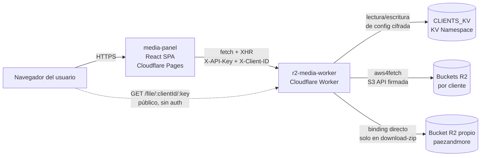

# Informe de Pruebas de Software — Panel Media (r2-media-worker + media-panel)

> **Curso:** Análisis y Modelación de Sistemas de Software
> **Proyecto:** Panel Media de Mizcor (backend `r2-media-worker` + frontend `media-panel`)
> **Rama de trabajo:** `feat/testing-suite` (en ambos repositorios)
> **Fecha:** abril 2026
> **Versión del documento:** v2 — worker completado (unitarias + integración); frontend pendiente
> **Estado:** secciones 1–5 completas; secciones 6–9 en redacción.

---

## Tabla de contenidos

1. [Descripción del proyecto y arquitectura](#1-descripción-del-proyecto-y-arquitectura)
2. [Identificación de pruebas unitarias](#2-identificación-de-pruebas-unitarias)
3. [Identificación de pruebas de integración](#3-identificación-de-pruebas-de-integración)
4. [Planificación de pruebas de seguridad](#4-planificación-de-pruebas-de-seguridad)
5. [Planificación de pruebas de privacidad](#5-planificación-de-pruebas-de-privacidad)

---

## 1. Descripción del proyecto y arquitectura

### 1.1 Contexto y Sistema Bajo Prueba (SUT)

El proyecto objeto de este ejercicio es **Panel Media**, una aplicación interna de la agencia Mizcor diseñada como gestor tipo "drive" para los activos gráficos (principalmente imágenes) de sus clientes. La aplicación está desplegada en la infraestructura de Cloudflare y se compone de dos artefactos desplegables independientes:

- **`r2-media-worker`** — Cloudflare Worker que expone una API HTTP sobre buckets de Cloudflare R2 (compatibles con la API de S3). Es el componente servidor del sistema; media toda comunicación con el almacenamiento, persistencia de configuración de clientes y control de acceso.
- **`media-panel`** — Single Page Application construida en React 19 + Vite que consume la API del worker. Provee la interfaz gráfica para operar sobre archivos y carpetas, administrar clientes y ejecutar operaciones en lote.

Conforme a la definición del SWEBOK, las pruebas de software constituyen la *validación dinámica* de que el SUT proporciona los comportamientos esperados en un conjunto finito de casos de prueba. En este ejercicio, el SUT comprende **ambos repositorios operando en conjunto**. No obstante, por razones de testabilidad y aislamiento (principios de controlabilidad y replicabilidad señalados por el SWEBOK), las suites de prueba se organizan por repositorio y se complementan con pruebas de integración entre ambos.

El proyecto ha estado en producción atendiendo al cliente **Paez And More** (instalador de pisos en Carolina del Sur) desde el cuarto trimestre de 2025. El ejercicio se enmarca en un momento oportuno: el sistema ya está estable, tiene volumen de uso real, pero **no fue escrito con pruebas automatizadas**. La ausencia total de pruebas previas fue el criterio de elegibilidad establecido por la actividad académica.

### 1.2 Arquitectura



**Notas sobre el diagrama:**

- El endpoint `GET /file/:clientId/:key` se muestra con línea punteada porque es el único camino **no autenticado** de la API. Esta decisión arquitectónica es intencional (URLs públicas para imágenes embebidas en sitios de clientes) y su verificación explícita forma parte del plan de pruebas de seguridad (sección 4).
- El binding `BUCKET` de R2 y las credenciales S3 por cliente apuntan a buckets distintos en el flujo general. La única excepción es `POST /api/download-zip`, que usa el binding directo. Esta heterogeneidad fue confirmada como hallazgo H-3.1 durante la implementación.

### 1.3 Componentes y responsabilidades

| Componente | Responsabilidad principal | Tecnologías clave |
|------------|---------------------------|-------------------|
| `media-panel` | Interfaz gráfica, procesamiento de imágenes en el browser (WASM), generación de ZIP y assets.ts, navegación de archivos, administración de clientes. | React 19, Vite 7, Tailwind 4, `@jsquash/*` (WASM), `fflate`. |
| `r2-media-worker` | API HTTP autenticada, cifrado/descifrado de credenciales S3, enrutamiento manual, operaciones sobre R2 vía S3 API. | Cloudflare Workers runtime, `aws4fetch`, `fflate`, Web Crypto API (AES-256-GCM). |
| `CLIENTS_KV` | Persistencia del catálogo de clientes y sus credenciales cifradas. | Cloudflare KV. |
| Buckets R2 por cliente | Almacenamiento de los archivos (imágenes, carpetas representadas como marcadores). | Cloudflare R2 (compatible S3). |

### 1.4 Dependencias externas

Las pruebas deben contemplar que el SUT depende de servicios externos que no pueden reproducirse fielmente en un entorno de laboratorio:

- **Cloudflare Workers runtime** — reproducible mediante Miniflare, que el pool `@cloudflare/vitest-pool-workers` invoca bajo el capó.
- **Cloudflare R2 (API S3)** — Miniflare simula R2 en memoria. Las pruebas no tocan la API real de Cloudflare.
- **Cloudflare KV** — Miniflare simula KV también en memoria.
- **`@jsquash/*` WASM codecs** — ejecutan en el browser; en JSDOM no están disponibles. Se excluyen del alcance unitario (ver sección 1.6).

### 1.5 Supuestos y alcance

- **Supuesto 1.** El comportamiento de Miniflare sobre R2 y KV es fiel al comportamiento de Cloudflare en producción.
- **Supuesto 2.** La `MASTER_KEY` se mantiene constante durante toda la ejecución de la suite. La rotación de claves queda fuera de alcance.
- **Supuesto 3.** Los archivos de imagen usados como fixtures son sintéticos (bytes controlados). El worker no valida contenido, solo MIME declarado y tamaño.
- **Supuesto 4.** La especificación a validar se deriva del código actual. Las pruebas confirman comportamiento actual y detectarán regresiones futuras. Los casos donde el comportamiento es cuestionable se registran como hallazgos.

**Objetivos del ejercicio:**

1. Demostrar aplicación sistemática de las técnicas del SWEBOK capítulo 3.
2. Cubrir la lógica de negocio crítica y las superficies de mayor riesgo.
3. Producir un entregable académico trazable que además quede como documentación viva del proyecto.
4. Identificar hallazgos concretos como subproducto del ejercicio.

### 1.6 Fuera de alcance

- **Procesamiento WASM de imagen** — requiere browser real; JSDOM no implementa `OffscreenCanvas`.
- **Pruebas contra Cloudflare real** — afectarían buckets de producción.
- **Pruebas de carga, estrés y rendimiento** — el volumen actual no lo justifica.
- **Ejecución de pruebas de usabilidad** — la sección 6 contendrá el plan sin resultados.
- **Pruebas de accesibilidad automatizadas** — los hallazgos se documentan en la sección 6.

---

## 2. Identificación de pruebas unitarias

### 2.1 Criterio de selección

Se identifican como candidatos los elementos que cumplen al menos uno de los siguientes criterios:

- **C1 — Función pura o determinística.** Sin efectos secundarios observables sobre KV, R2 o el DOM.
- **C2 — Módulo con interfaz clara.** Contrato tipado con dependencias sustituibles.
- **C3 — Reglas de negocio extraíbles.** Lógica de validación inline en handlers, refactorizable como función pura.

**Decisión 2.1.** Cuando una regla de negocio esté inline en un handler, se extrae como función pura antes de probarla. Los refactors se registran en commits separados de los tests, alineados con el principio de shift-left testing del SWEBOK.

### 2.2 Pruebas unitarias — Worker ✅ IMPLEMENTADAS

> **Estado:** 73 tests pasando en `test/unit/`. Commits `442f8ac` → `67f53f8`.

| ID | Módulo / función | Ubicación | Técnica SWEBOK | Tests impl. | Estado |
|----|------------------|-----------|----------------|-------------|--------|
| **U-W-01** | `encryptCredentials / decryptCredentials` — roundtrip | `src/crypto.ts` | Partición de equivalencia | 5: credenciales típicas, secreto vacío, Unicode/emoji, string largo 2KB, credenciales S3 reales | ✅ |
| **U-W-02** | `encryptCredentials` — unicidad de IV | `src/crypto.ts` | Pruebas de propiedad | 3: 100 IV distintos consecutivos, 100 ciphertexts distintos, IV distintos entre masterKeys | ✅ |
| **U-W-03** | `decryptCredentials` — fallos controlados | `src/crypto.ts` | Excepciones forzadas | 5: masterKey incorrecta, IV manipulado, tampering de ciphertext, blob truncado, blob inválido | ✅ |
| **U-W-04** | `resolveOrigin` | `src/cors.ts` | Tabla de decisión | 6: allowlist ×2, env.ALLOWED_ORIGIN, no autorizado, header ausente, header vacío | ✅ |
| **U-W-05** | `corsHeaders` | `src/cors.ts` | Partición de equivalencia | 5: refleja origen, métodos, headers, Vary, ausencia de Allow-Credentials | ✅ |
| **U-W-06** | `isAuthorized` | `src/router.ts` (exportada) | Partición de equivalencia | 7: correcta, incorrecta, ausente, vacía, ambos vacíos (H-2.5), case-sensitive valor, case-insensitive nombre | ✅ |
| **U-W-07** | `sanitizeEndpoint` ⚠️ | `src/validators.ts` | Valores límite | 8: limpio, trailing slash, múltiples slashes, sufijo bucket, combinado, bucket en subdominio, vacío, espacios | ✅ |
| **U-W-08** | `isAllowedMimeType` ⚠️ | `src/validators.ts` | Partición de equivalencia | 11: 6 MIMEs permitidos + 5 inválidos | ✅ |
| **U-W-09** | `isFileSizeAllowed` ⚠️ | `src/validators.ts` | Análisis de valores límite | 7: 1 byte, MAX-1, MAX, MAX+1, 100MB, 0 bytes (H-2.6), negativo (H-2.6) | ✅ |
| **U-W-10** | `isAllowedCacheControl` ⚠️ | `src/validators.ts` | Partición de equivalencia | 7: 3 válidos, arbitrario, vacío, null (H-2.7), case-sensitive | ✅ |
| **U-W-11** | `resolveMaxAge` ⚠️ | `src/validators.ts` | Partición de equivalencia | 7: 3 valores válidos, no en lista, undefined, 0, negativo | ✅ |
| **U-W-12** | Parser de path `/file/:clientId/*key` | `src/router.ts` | — | Diferido a I-W-02 — parser inline de 9 líneas sin extracción neta | ↪ I-W-02 |

**⚠️** = requería refactor previo. Implementado en commit `c9685d6`.

**Desviación registrada:** Las funciones de cifrado son `encryptCredentials` / `decryptCredentials` sobre `ClientCredentials`, no `encrypt` / `decrypt` sobre strings arbitrarios. El JSON.stringify/parse es interno al módulo. Los tests adaptan los casos preservando la intención original. Documentado en JSDoc de `test/unit/crypto.test.ts`.

### 2.3 Pruebas unitarias — Frontend 🔲 PENDIENTES

| ID | Módulo / función | Ubicación | Técnica SWEBOK | Casos representativos | Prioridad |
|----|------------------|-----------|----------------|------------------------|-----------|
| **U-F-01** | `generateAssetsTs` | `src/utils/generateAssets.ts` | Partición de equivalencia + valores límite | Array vacío, una carpeta, múltiples carpetas, caracteres especiales, clientId con encoding. | Media |
| **U-F-02** | `toSlug` en BulkRenameModal | `src/components/BulkRenameModal.tsx:13-20` | Partición de equivalencia + fuzzing | ASCII, diacríticos, emoji, múltiples espacios, guiones extremos, vacío, solo no-alfanuméricos. | Media |
| **U-F-03** | `toSlug` en UploadOptimizationModal | `src/components/UploadOptimizationModal.tsx:31-33` | Partición de equivalencia | Mismos casos que U-F-02 — detectará divergencia (H-2.1). | Media |
| **U-F-04** | Clamp de columnas | `src/hooks/useViewPreferences.ts:25` | Valores límite | 1→2, 2→2, 5→5, 8→8, 9→8, -3→2, NaN. | Media |
| **U-F-05** | `handlePresetClick` auto-ajuste de calidad | `src/hooks/useCompressionSettings.ts:87-105` | Tabla de decisión | Matriz (calidad actual) × (minQuality del preset). | Baja |
| **U-F-06** | Sanitización de endpoint en cliente | `src/components/AddClientModal.tsx:60-66` | Valores límite | Mismos casos que U-W-07 — detectará divergencia (H-2.2). | Alta |
| **U-F-07** | `canSubmit` de AddClientModal | `src/components/AddClientModal.tsx:58` | Partición de equivalencia | Cada campo omitido → disabled; todos presentes → enabled. | Media |
| **U-F-08** | Filtrado drag-drop | `src/components/MediaPanel.tsx:390` | Partición de equivalencia | Solo imágenes, mezcla, solo no-imágenes → vacío. | Media |
| **U-F-09** | `downloadTextFile` | `src/utils/downloadZip.ts` | Partición de equivalencia | Blob, setAttribute, click, revoke con mocks. | Baja |
| **U-F-10** | `cacheBust` ⚠️ | `src/components/ImageLightbox.tsx` (inline) | Partición de equivalencia | URL sin query → `?v=`; con query → `&v=`. Requiere extracción. | Baja |
| **U-F-11** | `ConfirmDeleteByNameModal` — validación | `src/components/ConfirmDeleteByNameModal.tsx` | Partición de equivalencia | Nombre exacto → enabled; espacios extra → disabled; case-insensitive → verificar. | Alta |
| **U-F-12** | `NewFolderModal` — validación | `src/components/NewFolderModal.tsx` | Partición de equivalencia + fuzzing | Vacío → disabled; solo espacios; caracteres inválidos para R2 (H-2.3). | Media |

### 2.4 Técnicas SWEBOK aplicadas (unitarias)

| Técnica SWEBOK cap. 3 | IDs aplicados |
|-----------------------|---------------|
| Partición de equivalencia | U-W-01, 04, 05, 06, 08, 10, 11 / U-F-01..03, 07..09, 11..12 |
| Análisis de valores límite | U-W-07, 09, 11 / U-F-01, 04, 06 |
| Tabla de decisión | U-W-04 / U-F-05 |
| Excepciones forzadas | U-W-03 |
| Fuzzing / pruebas aleatorias | U-F-02, 03, 12 |
| Pruebas de propiedad (metamórficas, SWEBOK §3.4) | U-W-02 |

### 2.5 Hallazgos detectados en pruebas unitarias

- **H-2.1** — `toSlug` duplicado en dos componentes. Tests U-F-02 y U-F-03 detectarán divergencia. Plan: consolidar en `src/utils/slug.ts`.
- **H-2.2** — Sanitización de endpoint duplicada frontend/backend. Tests U-W-07 y U-F-06 verifican concordancia.
- **H-2.3** — `NewFolderModal` no valida caracteres. Test U-F-12 documenta comportamiento actual.
- **H-2.4** — Validaciones inline en handlers. ✅ Resuelto via Decisión 2.1 (commit `c9685d6`).
- **H-2.5** ⚠️ — **Bypass de autenticación con `API_SECRET` vacío.** `isAuthorized` usa `=== env.API_SECRET` sin verificar que el secret sea truthy. Si ambos (secret y header) son cadena vacía: `'' === '' → true`, autentica. Documentado in-place en `test/unit/auth.test.ts` con `toBe(true)` y JSDoc. **Corrección propuesta:** añadir `&& !!env.API_SECRET`, idealmente con `crypto.subtle.timingSafeEqual` para resistir timing attacks. Requiere Decision Record.
- **H-2.6** — `isFileSizeAllowed(-1) → true`. No es bug funcional (Web API garantiza `file.size >= 0`) pero el contrato no protege su precondición. Documentado in-place.
- **H-2.7** — `isAllowedCacheControl(null) → false` sin explosión. Comportamiento correcto por construcción. Sin acción requerida.

---

## 3. Identificación de pruebas de integración

### 3.1 Criterio de selección y estrategia

El SWEBOK define las pruebas de integración como aquellas que "verifican las interacciones entre los elementos del SUT". Se identifican cuatro superficies:

1. **Worker ↔ bindings Cloudflare (KV + R2)** — cubierta con `@cloudflare/vitest-pool-workers` + Miniflare.
2. **Worker ↔ worker (handlers encadenados)** — flujos multi-endpoint.
3. **Frontend ↔ Worker (HTTP)** — cubierta con MSW.
4. **Frontend ↔ DOM** — cubierta con `@testing-library/react` + JSDOM.

**Estrategia:** incremental mixta — bottom-up para el worker, top-down para el frontend. Se descarta big-bang por ser explícitamente desaconsejado en el SWEBOK.

**Decisión 3.1.** Helper `test/helpers/factories.ts` con `uniqueClientId()`, `clientPayload()` y `clientHeaders()`. Los IDs únicos garantizan aislamiento sin limpiar KV/R2 entre tests.

**Decisión 3.2.** Handlers MSW en el frontend organizados por endpoint, no por flujo.

### 3.2 Pruebas de integración — Worker ✅ IMPLEMENTADAS

> **Estado:** 60 tests pasando en `test/integration/`. Bloque 3.

| ID | Flujo | Endpoints involucrados | Técnica | Tests impl. | Estado |
|----|-------|------------------------|---------|-------------|--------|
| **I-W-01** | CRUD completo de cliente | POST/GET/PATCH/DELETE `/api/clients` | Transición de estados | 5: crear+listar, actualizar env, eliminar+listar, duplicado→409, campos faltantes→400 | ✅ |
| **I-W-02** | Upload → list → download → delete | `/api/upload`, `/api/list`, `/file/...`, `/api/delete` | Transición de estados | 3: sube+aparece, accesible sin auth, elimina+desaparece | ✅ |
| **I-W-03** | Confirmación destructiva prod vs test | `/api/delete` | Tabla de decisión | 7: matriz completa env × confirmed-name, undefined tratado como prod | ✅ |
| **I-W-04** | Rename de archivo | `/api/upload`, `/api/rename`, `/api/list` | Transición de estados | 1 flujo: nuevo key accesible, anterior 404 | ✅ |
| **I-W-05** | Rename de carpeta con múltiples objetos | `/api/folder`, `/api/upload`×3, `/api/rename-folder` | Transición de estados | 1 flujo: 3 archivos migran, 0 en prefijo anterior | ✅ |
| **I-W-06** | Delete-recursive | `/api/upload`×N, `/api/delete-recursive` | Transición de estados | 1 flujo: N archivos eliminados, carpeta vacía | ✅ |
| **I-W-07** | Download-zip por `keys[]` | `/api/upload`×2, `/api/download-zip` | Pruebas basadas en escenarios | 1: ZIP válido, Content-Type, Content-Disposition, bytes reproducibles | ✅ |
| **I-W-08** | Download-zip por `prefix` | `/api/upload`×3, `/api/download-zip` | Pruebas basadas en escenarios | 2 + confirmación de H-3.1 | ✅ |
| **I-W-09** | Paginación en `/api/list` | `/api/list?limit=` | Valores límite | 3: límite 100 respetado, nextCursor cuando hay más, segunda página con cursor | ✅ |
| **I-W-10** | Creación de carpeta y listado | `/api/folder`, `/api/list`, `/api/folders` | Pruebas basadas en escenarios | 2: aparece en list y en folders | ✅ |
| **I-W-11** | Autorización sobre todos los endpoints | 11 endpoints protegidos | Tabla de decisión | 22: sin key→401 y key incorrecta→401, parametrizados con `it.each` | ✅ |
| **I-W-12** | CORS en todas las respuestas | Varios endpoints | Tabla de decisión | 5: 200, 401, 400, OPTIONS→204, origen externo→fallback | ✅ |

### 3.3 Pruebas de integración — Frontend 🔲 PENDIENTES

| ID | Flujo | Componentes / hooks | Técnica | Casos representativos | Prioridad |
|----|-------|---------------------|---------|------------------------|-----------|
| **I-F-01** | `useClients` CRUD con MSW | `useClients.ts` | Transición de estados | loading→ready→addClient→removeClient→editClient. | Alta |
| **I-F-02** | `useMediaCache` upload con XHR progress | `useMediaCache.ts` + mock XHR | Pruebas basadas en escenarios | Progress 10/50/100%, invalidate+doFetch al completar. | Alta |
| **I-F-03** | `useMediaCache` invalidación en move | `useMediaCache.moveFile` + MSW | Transición de estados | Invalidate sobre currentPrefix y destPrefix. | Media |
| **I-F-04** | `useMediaCache` cache hit vs miss | `useMediaCache.doFetch` | Partición de equivalencia | Primera→fetch, segunda→cache, tras invalidate→miss, cambio clientId→clearAll. | Media |
| **I-F-05** | `AddClientModal` flujo completo | `AddClientModal` + `useClients` + MSW | Pruebas basadas en escenarios | Inputs, auto-slug, submit, cierre, aparición en lista. | Alta |
| **I-F-06** | `NewFolderModal` flujo de creación | `NewFolderModal` + MSW | Pruebas basadas en escenarios | Nombre, submit→POST con path construido, cierre y refresh. | Media |
| **I-F-07** | `MoveFileModal` disabled cuando dest==current | `MoveFileModal` | Tabla de decisión | Botón disabled cuando dest===current, enabled al cambiar. | Media |
| **I-F-08** | `ConfirmExitModal` dentro de modal | `NewFolderModal` + `ConfirmExitModal` | Transición de estados | Escribir→cerrar→confirmExit→Continuar vuelve; Salir cierra sin guardar. | Media |
| **I-F-09** | `ConfirmDeleteByNameModal` solo en prod | `FileGrid` + modal | Tabla de decisión | isProd=true→modal por nombre; false→confirm simple. | Alta |
| **I-F-10** | Toast auto-dismiss y Deshacer | `ToastProvider` + `useToast` | Transición de estados | Aparece, click→callback, 4s→desaparece. | Baja |

### 3.4 Técnicas SWEBOK aplicadas (integración)

| Técnica SWEBOK cap. 3 | IDs aplicados |
|-----------------------|---------------|
| Pruebas de transición de estados | I-W-01..06 / I-F-01, 03, 08, 10 |
| Tabla de decisión | I-W-03, 11, 12 / I-F-07, 09 |
| Pruebas basadas en escenarios | I-W-07, 08, 10 / I-F-02, 05, 06 |
| Análisis de valores límite | I-W-09 |
| Partición de equivalencia | I-F-04 |

### 3.5 Hallazgos detectados en integración

- **H-3.1** ⚠️ — **`download-zip` lee del binding R2 directo, no del bucket S3 del cliente.** Confirmado en I-W-08. `POST /api/download-zip` usa `env.BUCKET.get(key)` (binding → bucket `paezandmore`), mientras que `POST /api/upload` usa `s3.s3Put()` con credenciales S3 por cliente. En producción funciona solo porque Paez And More es el único cliente y su bucket coincide con el binding. Para cualquier cliente futuro con `bucketName` distinto, `download-zip` devolverá archivos del bucket equivocado o un ZIP vacío, **sin ningún error explícito**. Es el hallazgo de mayor impacto arquitectónico del ejercicio. **Requiere Decision Record antes del onboarding de nuevos clientes.**
- **H-3.2** — Operaciones no atómicas en `rename-folder` y `delete-recursive`. Fallo a mitad → estado inconsistente sin recovery. Cubre el camino feliz en I-W-05/06; manejo de fallos parciales queda como DR futuro.
- **H-3.3** — `Map` module-level en `mediaCache.ts` acopla tests del frontend. Mitigado con `clearAll()` en `beforeEach`.
- **H-3.4** — XHR en `uploadFiles` no interceptable por MSW. Mitigado con stub manual de `XMLHttpRequest`. Refactorizar a `fetch` + `ReadableStream` registrado como DR.
- **H-3.5** — **Nota técnica:** `fetchMock.activate()` en `beforeEach` no propaga al contexto del worker cuando se usa `SELF`. Los mocks deben configurarse inline. Comportamiento no documentado en `@cloudflare/vitest-pool-workers`.
- **H-3.6** — **Nota técnica:** `URLSearchParams` ordena parámetros alfabéticamente. Los matchers de URLs S3 deben buscar `list-type=2` en cualquier posición, no asumir orden fijo.

---

## 4. Planificación de pruebas de seguridad

### 4.1 Marco conceptual

El SWEBOK (sección 2, *Security Testing*) define estas pruebas como aquellas que "validan que el SUT esté protegido contra ataques externos, verificando la confidencialidad, integridad y disponibilidad". El modelo CIA guía la organización de esta sección.

Para Panel Media, la superficie de ataque está delimitada por:

- La API del worker (único punto de entrada para operaciones administrativas).
- El endpoint público `GET /file/:clientId/:key` (intencionalmente sin autenticación).
- El KV namespace, que almacena credenciales cifradas con AES-256-GCM.
- La `MASTER_KEY`, cuya compromisión daría acceso a todas las credenciales de todos los clientes.

Los tests de esta sección se implementan en `test/security/` del worker, complementando el smoke test existente.

### 4.2 Pruebas de seguridad — Worker

| ID | Categoría CIA | Descripción | Técnica | Caso esperado | Prioridad |
|----|---------------|-------------|---------|---------------|-----------|
| **S-W-01** | Confidencialidad | Request sin `X-API-Key` a endpoint protegido | Excepciones forzadas | 401 con `{ error: 'Unauthorized' }` | **Crítica** |
| **S-W-02** | Confidencialidad | Request con `X-API-Key` incorrecto | Excepciones forzadas | 401 | **Crítica** |
| **S-W-03** | Confidencialidad | Request con `X-API-Key` vacío | Excepciones forzadas | 401 esperado. Si `API_SECRET` también vacío → 200 (H-2.5). Documentar comportamiento real. | **Crítica** |
| **S-W-04** | Confidencialidad | `GET /api/clients` no expone credenciales | Inspección de respuesta | La respuesta no contiene `accessKeyId`, `secretAccessKey` ni el blob `EncryptedBlob`. Solo campos de `ClientConfig`. | **Crítica** |
| **S-W-05** | Confidencialidad | Ningún endpoint devuelve credenciales descifradas | Inspección exhaustiva | Recorrer todos los endpoints con respuesta no-vacía; ningún body contiene las claves JSON `accessKeyId` o `secretAccessKey`. Test parametrizado con `it.each`. | **Crítica** |
| **S-W-06** | Integridad | Upload con MIME no permitido | Partición de equivalencia | `application/pdf`, `image/tiff`, `text/html` → 400. Archivo no escrito en R2. | Alta |
| **S-W-07** | Integridad | Upload excediendo 10 MB | Valores límite | 10MB+1 byte → 400. Archivo no queda parcialmente escrito. | Alta |
| **S-W-08** | Integridad | Upload con Content-Type incorrecto | Partición de equivalencia | `application/json` en lugar de `multipart/form-data` → 400 | Media |
| **S-W-09** | Integridad | Delete en producción sin `X-Confirmed-Name` | Excepciones forzadas | 412. El archivo debe seguir existiendo tras el rechazo. | **Crítica** |
| **S-W-10** | Integridad | Delete en producción con `X-Confirmed-Name` incorrecto | Excepciones forzadas | 412. Mismo principio. | **Crítica** |
| **S-W-11** | Integridad | Path traversal en key de archivo | Fuzzing | Keys como `../`, `../../secrets`, `%2e%2e%2f` → verificar que el worker no redirige a objetos fuera del bucket del cliente. R2 trata keys como identificadores opacos; el test confirma que no hay transformación interna riesgosa. | Alta |
| **S-W-12** | Disponibilidad | Headers CORS presentes en respuestas de error | Tabla de decisión | Respuestas 400, 401, 404, 412, 500 incluyen `Access-Control-Allow-Origin`. El try/catch global en `src/index.ts` garantiza esto; el test lo verifica explícitamente. | Alta |
| **S-W-13** | Disponibilidad | Worker responde coherentemente ante body malformado | Excepciones forzadas | POST con body no-JSON o JSON truncado → 400 o 500 con CORS headers. No expone stack traces ni mensajes internos de Cloudflare. | Media |
| **S-W-14** | Confidencialidad | Origen no autorizado recibe fallback CORS, no wildcard | Tabla de decisión | Request desde `https://evil.com` → `Access-Control-Allow-Origin: https://panel.mizcor.dev` (fallback correcto, no `*`). | Media |
| **S-W-15** | Confidencialidad | Endpoint público `/file/:clientId/:key` accesible sin auth | Confirmación de diseño | GET sin `X-API-Key` → 200. Documentado como decisión de diseño intencional. | Media |

**Nota sobre S-W-11 (path traversal):** R2 trata las keys como identificadores opacos. El carácter `/` es válido en una key y no actúa como separador de directorio real. Una key `../secret` referencia literalmente un objeto con ese nombre, no un path relativo. El test verifica que el worker no introduce ninguna transformación que pueda redirigir el acceso.

### 4.3 Pruebas de seguridad — Frontend

Los tests de seguridad del frontend son más limitados porque la lógica de autorización vive en el worker. Las dos superficies relevantes son:

| ID | Descripción | Técnica | Caso esperado | Prioridad |
|----|-------------|---------|---------------|-----------|
| **S-F-01** | `VITE_API_SECRET` no se renderiza en el DOM | Inspección del DOM | La key no aparece en ningún elemento visible tras renderizar la app. | Alta |
| **S-F-02** | La app no incluye el secret en URLs construidas | Inspección | Ninguna operación construye URLs con el secret como query param o path segment. | Media |

### 4.4 Distribución de archivos de implementación

```
test/security/
├── smoke.test.ts              (existente — smoke de auth básico)
├── auth.test.ts               (S-W-01..03)
├── data-exposure.test.ts      (S-W-04..05)
├── input-validation.test.ts   (S-W-06..08, S-W-11, S-W-13)
├── destructive-ops.test.ts    (S-W-09..10)
└── cors.test.ts               (S-W-12, S-W-14..15)
```

Varios casos de seguridad (S-W-01, S-W-09, S-W-10) ya están cubiertos implícitamente por los tests de integración (I-W-11, I-W-03). Los tests de seguridad los abordan desde un ángulo diferente: no están interesados en el flujo de negocio completo, sino en el comportamiento de defensa aislado y en que el sistema falla de forma segura.

---

## 5. Planificación de pruebas de privacidad

### 5.1 Marco conceptual

El SWEBOK (sección 2, *Privacy Testing*) define estas pruebas como aquellas dedicadas a "evaluar la seguridad y privacidad de los datos personales de los usuarios, así como las políticas para compartir información". En Panel Media, los datos más sensibles no son datos personales de usuarios finales, sino **credenciales S3 de los clientes de Mizcor** — secretos de infraestructura cuya filtración permitiría a un atacante leer, modificar o eliminar archivos del bucket del cliente sin restricciones.

El modelo de privacidad del sistema descansa en tres pilares:

1. **Cifrado AES-256-GCM en reposo.** Las credenciales se cifran con `encryptCredentials` antes de guardarse en KV. La `MASTER_KEY` es el único punto de compromisión total.
2. **Nunca en tránsito.** Las credenciales descifradas (`accessKeyId`, `secretAccessKey`) nunca deben aparecer en ninguna respuesta HTTP del worker.
3. **Eliminación completa.** Al eliminar un cliente, tanto `client:{id}` como `creds:{id}` deben desaparecer de KV.

### 5.2 Pruebas de privacidad — Worker

| ID | Pilar | Descripción | Técnica | Caso esperado | Prioridad |
|----|-------|-------------|---------|---------------|-----------|
| **P-W-01** | Cifrado en reposo | Credenciales almacenadas en KV están cifradas | Inspección de estado | Crear cliente → leer KV directamente → `creds:{id}` es `EncryptedBlob { iv, data }` en base64, no credenciales en texto plano. | **Crítica** |
| **P-W-02** | Cifrado en reposo | El blob no es reversible sin `MASTER_KEY` | Propiedad criptográfica | `JSON.parse(blob.data)` sin descifrar no produce credenciales legibles. El `data` es ciphertext opaco. | **Crítica** |
| **P-W-03** | Cifrado en reposo | Cada cliente tiene IV único | Prueba de propiedad | Crear dos clientes con las mismas credenciales → blobs con `iv` distintos. Consecuencia observable de U-W-02 a nivel de integración. | **Crítica** |
| **P-W-04** | Nunca en tránsito | `GET /api/clients` no filtra credenciales | Inspección de respuesta | Lista de clientes no contiene `accessKeyId`, `secretAccessKey`, ni campo `creds`. Solo campos de `ClientConfig`. | **Crítica** |
| **P-W-05** | Nunca en tránsito | Ningún endpoint devuelve credenciales descifradas | Inspección exhaustiva | Todos los endpoints con respuesta no-vacía: ningún body contiene `accessKeyId` o `secretAccessKey` como claves JSON. Parametrizado por endpoint. | **Crítica** |
| **P-W-06** | Nunca en tránsito | Respuesta de error 500 no expone internals | Inspección | Forzar error interno (MASTER_KEY inválida) → body solo contiene `{ error: "mensaje genérico" }`, sin stack trace ni valores de variables. | Alta |
| **P-W-07** | Eliminación completa | Delete de cliente borra también `creds:{id}` | Verificación post-delete | `DELETE /api/clients/:id` → leer KV → `client:{id}` ausente **Y** `creds:{id}` ausente. Si solo uno se borra, se registra como fuga de datos. | **Crítica** |
| **P-W-08** | Eliminación completa | `clients:index` se actualiza al eliminar | Verificación de consistencia | Tras delete, el índice no contiene el id eliminado. Previene recuperación de ids "eliminados" por reuso. | Alta |
| **P-W-09** | Cifrado en reposo | La clave derivada usa AES-256 (256 bits) | Inspección del módulo | Los parámetros de `crypto.subtle.importKey` en `src/crypto.ts` especifican `{ name: 'AES-GCM', length: 256 }`. | Alta |

### 5.3 Pruebas de privacidad — Frontend

| ID | Descripción | Técnica | Caso esperado | Prioridad |
|----|-------------|---------|---------------|-----------|
| **P-F-01** | `VITE_API_SECRET` no se renderiza en el DOM | Inspección del DOM | El valor del secret no aparece en ningún elemento visible tras renderizar la app. | Alta |
| **P-F-02** | `VITE_API_SECRET` no se persiste en `localStorage` | Inspección de estado | Después de cualquier operación, `localStorage` no contiene el secret. | Alta |
| **P-F-03** | La app no logea credenciales a consola | Inspección | Mock de `console.log/error/warn` → ninguna llamada contiene el secret ni strings con patrón de credenciales S3 (`AKIA*`). | Media |

### 5.4 Relación con hallazgos previos

Las pruebas de privacidad están directamente informadas por los hallazgos anteriores:

- **U-W-02** estableció la unicidad de IV a nivel de función pura. **P-W-03** verifica la misma propiedad a nivel de integración real con KV de Miniflare.
- **H-2.5** (bypass de auth con secret vacío) tiene implicación directa en privacidad: si el worker opera sin `API_SECRET`, un atacante puede listar clientes y exponer sus metadatos de configuración, aunque las credenciales permanezcan cifradas en KV.
- **H-3.1** (download-zip con binding directo) afecta privacidad en sentido inverso: un cliente podría recibir archivos de otro cliente si el bucket no coincide con el binding. En el contexto actual (un solo cliente activo) no es explotable, pero **es el riesgo de privacidad más alto del sistema** para escenarios multicliente.

### 5.5 Distribución de archivos de implementación

```
test/privacy/
├── smoke.test.ts              (existente — it.todo placeholder)
├── credentials-at-rest.test.ts  (P-W-01..03, P-W-09)
├── no-leak-in-transit.test.ts   (P-W-04..06)
└── deletion.test.ts             (P-W-07..08)
```

---

## Anexos

### A. Trazabilidad de commits (worker, rama `feat/testing-suite`)

| Commit | Descripción | IDs cubiertos |
|--------|-------------|---------------|
| `bf4f8a9` | Setup: vitest infrastructure + smoke tests | — |
| `442f8ac` | Unitarias crypto AES-GCM | U-W-01..03 |
| `6c26c94` | Unitarias CORS | U-W-04..05 |
| `6669147` | Unitarias auth + export `isAuthorized` | U-W-06 |
| `c9685d6` | Refactor: extracción de validadores a `src/validators.ts` | Decisión 2.1 / H-2.4 |
| `67f53f8` | Unitarias validadores | U-W-07..11 |
| *(bloque 3)* | Integración: clientes, archivos, carpetas, seguridad+cors | I-W-01..12 |

### B. Estado de implementación por repositorio

| Repo | Categoría | Tests actuales | Estado |
|------|-----------|---------------|--------|
| Worker | Unitarias | 73 | ✅ Completo |
| Worker | Integración | 60 | ✅ Completo |
| Worker | Seguridad | ~30 est. | 🔲 Plan en §4 |
| Worker | Privacidad | ~15 est. | 🔲 Plan en §5 |
| Frontend | Unitarias | ~50 est. | 🔲 Plan en §2.3 |
| Frontend | Integración | ~40 est. | 🔲 Plan en §3.3 |
| **Total actual** | | **133 passing + 1 todo** | |

### C. Hallazgos consolidados

| ID | Severidad | Descripción breve | Sección | Estado |
|----|-----------|-------------------|---------|--------|
| H-2.1 | Baja | `toSlug` duplicado en dos componentes | §2.5 | Pendiente DR |
| H-2.2 | Baja | Sanitización de endpoint duplicada frontend/backend | §2.5 | Pendiente DR |
| H-2.3 | Baja | `NewFolderModal` no valida caracteres | §2.5 | Documentado |
| H-2.4 | Baja | Validaciones inline en handlers | §2.5 | ✅ Resuelto |
| H-2.5 | **Alta** | Bypass de auth con `API_SECRET` vacío | §2.5 | Pendiente DR |
| H-2.6 | Baja | `isFileSizeAllowed(-1) → true` | §2.5 | Documentado |
| H-2.7 | Info | `isAllowedCacheControl(null) → false` sin explosión | §2.5 | Documentado |
| H-3.1 | **Alta** | `download-zip` lee bucket equivocado para clientes no-paezandmore | §3.5 | **Pendiente DR urgente** |
| H-3.2 | Media | Operaciones no atómicas en rename/delete recursivo | §3.5 | Pendiente DR |
| H-3.3 | Baja | `Map` module-level en mediaCache acopla tests | §3.5 | Mitigado |
| H-3.4 | Baja | XHR en uploadFiles no interceptable por MSW | §3.5 | Mitigado |
| H-3.5 | Info | fetchMock no propaga a contexto SELF | §3.5 | Documentado |
| H-3.6 | Info | URLSearchParams ordena parámetros alfabéticamente | §3.5 | Documentado |

### D. Glosario

| Término | Definición |
|---------|-----------|
| **SUT** | System Under Test — el sistema objeto de la prueba. |
| **Falla (fault)** | El defecto en el código que causa un mal funcionamiento. |
| **Fallo (failure)** | El efecto observable cuando la falla se ejecuta. |
| **Oráculo** | Agente que decide si el SUT se comportó correctamente ante una prueba. |
| **Miniflare** | Simulador local del runtime de Cloudflare Workers. |
| **MSW** | Mock Service Worker — interceptación de requests HTTP en tests del frontend. |
| **Testability** | Facilidad con la que un elemento del SUT puede ser sometido a prueba. |
| **AES-GCM** | Advanced Encryption Standard — modo Galois/Counter. Cifrado autenticado que garantiza confidencialidad e integridad. |
| **IV** | Initialization Vector — valor aleatorio único por operación de cifrado AES-GCM. Su reutilización con la misma clave es una vulnerabilidad crítica. |
| **CIA** | Confidentiality, Integrity, Availability — triada del modelo de seguridad. |

### E. Próximas secciones

- **Sección 6.** Planificación de pruebas de usabilidad — hallazgos de accesibilidad (ausencia de ARIA, labels sin `htmlFor`, modales sin `role="dialog"`) y protocolo de evaluación.
- **Sección 7.** Síntesis de técnicas aplicadas — mapeo global al SWEBOK capítulo 3.
- **Sección 8.** Medidas de cobertura y *mutation score* — resultados numéricos al cierre del ejercicio.
- **Sección 9.** Conclusiones y hallazgos consolidados — narrativa final.

---

*Fin de la v2 — secciones 1–5 completas.*
